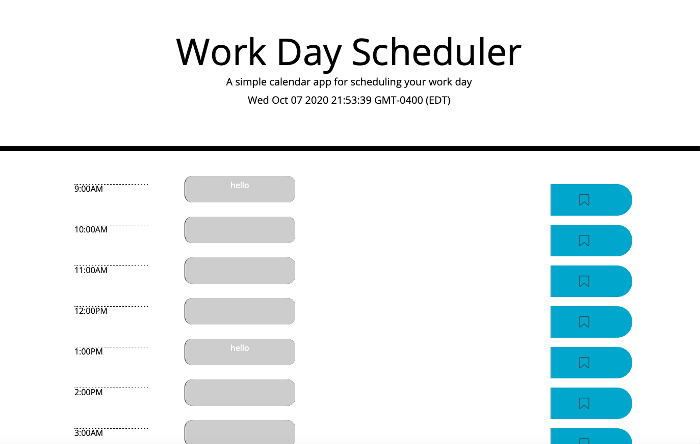

# daily-planner

# password-generator-

Description

It is time to conquer JQuery! During the last two weeks in our program we have been deep diving into the world of Javascript. We have been learning how to successfully use DOM manipulation, traversing the DOM and writting/calling different Javascript functions. Once we understood the basics we then moved on to JQuery documentation. This assignment is to show how we can code a complex daily scheduler as effeciently as possible.

This assigment was a three step process. The first step, as in many assigments, is to pseudocode the project. Once I psuedocoded the assignment and knew what needed to be done, I then moved over to HTML. The first step to the HTML portion of the project was to create the scehedule grid. It was important to seperate each section by it's own row. Within each row you have the hour input, the text input, and the save button. Once you have the grid all set up, it is time to move on to Javascript/JQuery. There were three steps that needed to be done in the javascript page. The first function we needed to add was placing the current day and time to the top of the webpage. Once we had that set up, it was time to write the renderColor function. This function changes the background color of the text-area due to the time of the day it is. Once we wrote that function and called it, it was time to save each save button to the local storage. Once we saved each button to the local storage.

It is important to be able to use JQuery because it is a more effecient documentation format than Javascript. We are able to write 3-5 lines of Javascript code as 1 line in JQuery. It is important to use JQuery when you are developing a product as a team so everyone is able to quickly read through the code and stay up to date.

There are many potential future projects to piggy back off of this assignment. One potential future projects for this assignment could be expanding the daily scheduler into a monthly scheduler. Another potential project could be adding color coded tasks within each hour textarea.

Acceptance Criteria

```
GIVEN I am using a daily planner to create a schedule
WHEN I open the planner
THEN the current day is displayed at the top of the calendar
WHEN I scroll down
THEN I am presented with time blocks for standard business hours
WHEN I view the time blocks for that day
THEN each time block is color-coded to indicate whether it is in the past, present, or future
WHEN I click into a time block
THEN I can enter an event
WHEN I click the save button for that time block
THEN the text for that event is saved in local storage
WHEN I refresh the page
THEN the saved events persist
```

Usage

To be able to view this site you can visit my Github profile. This site is also listed below:

-https://github.com/JenniferFunchess/daily-planner

-https://jenniferfunchess.github.io/daily-planner/

\_\_

Below are photos of the completed password generator:



Credits

Thank you to each of the websites below for their help in completeing this assignment.

https://phoenixnap.com/kb/how-to-get-the-current-date-and-time-javascript

https://api.jquery.com/event.timeStamp/

https://youtube.com

https://www.w3schools.com/cssref/pr_grid-column.asp

HTML Validation

Each HTML document along with the CSS stylesheet has been validated and corrected with help of:
https://validator.w3.org/nu/#textarea

Contributing

Thank you to my wonderful tutor, Sean Brown-Byfield, for helping me with this assignment!
Also thank you to my wonderful TA , Peter Colella for helping me with this assignment as well!
